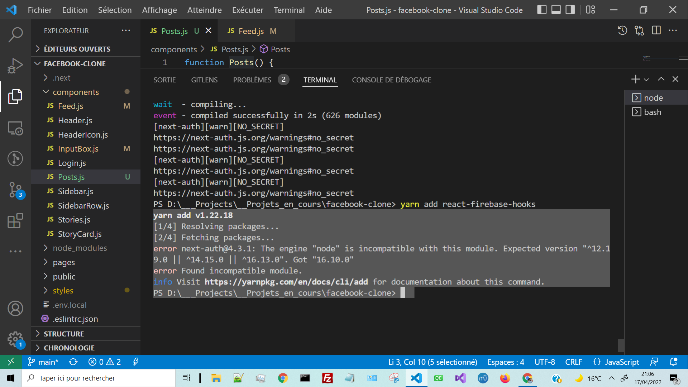

# Error package installation with npm:

> Installing react-firebase-hooks (ERROR)

    yarn add react-firebase-hooks

> Installing react-firebase-hooks (Succeed):

*Not the best solution:*

    yarn add react-firebase-hooks --ignore-engines

Inspecting the error message:

    ...
    The engine "node" is incompatible with this module. Expected version "^12.19.0 || ^14.15.0 || ^16.13.0". Got "16.10.0"
    error Found incompatible module.
    ...

How to get the current node version:

    node -v
    v16.10.0

We simply need to update node.js version:
> Go to the node official website and download node js installer.
Nodejs intaller will automatically update your local version of node.

[official-nodejs-website](https://nodejs.org/en/)

## What's the difference between tilde and caret in package.json file?

[Stackoverflow-explanation](https://stackoverflow.com/questions/22343224/whats-the-difference-between-tilde-and-caret-in-package-json)

> ~version “Approximately equivalent to version”, will update you to all future patch versions, without incrementing the minor version. ~1.2.3 will use releases from 1.2.3 to <1.3.0.

> ^version “Compatible with version”, will update you to all future minor/patch versions, without incrementing the major version. ^2.3.4 will use releases from 2.3.4 to <3.0.0.