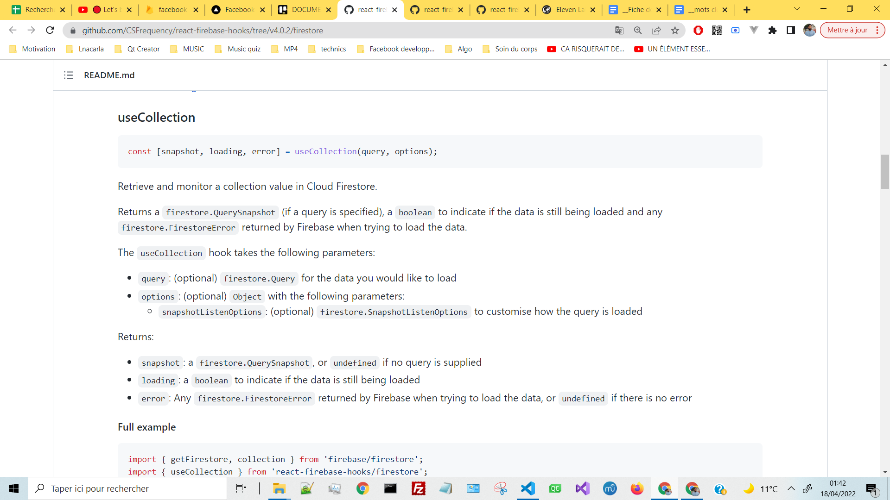
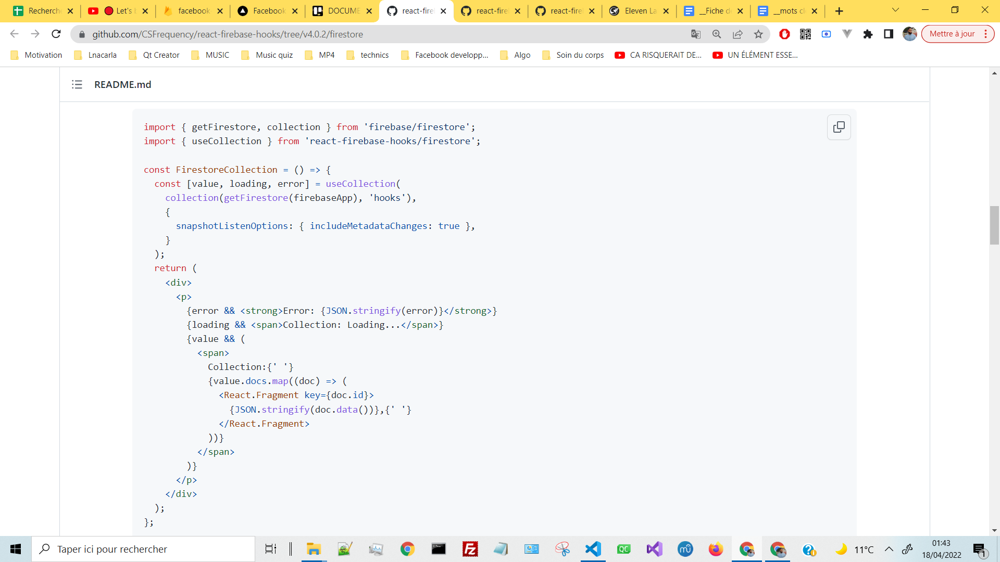
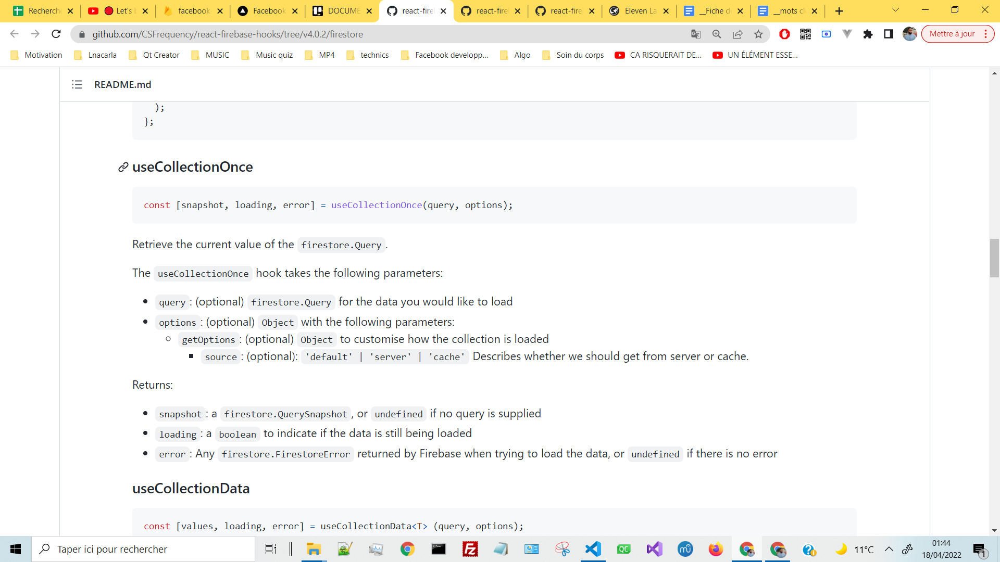
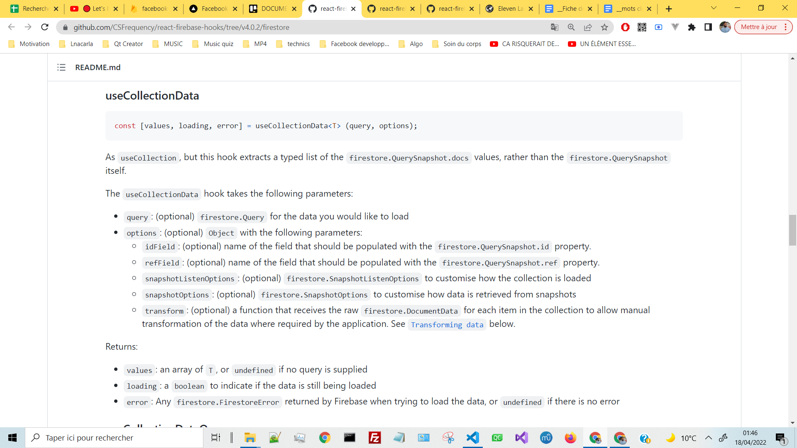
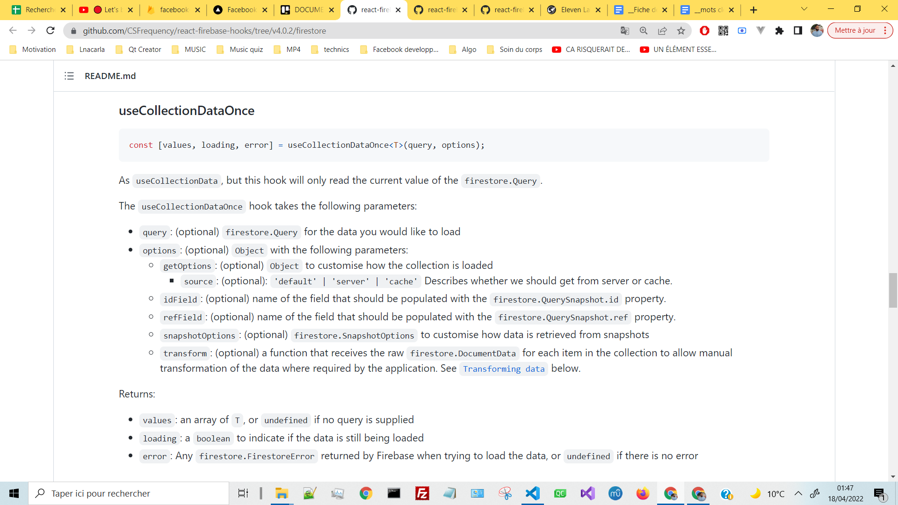
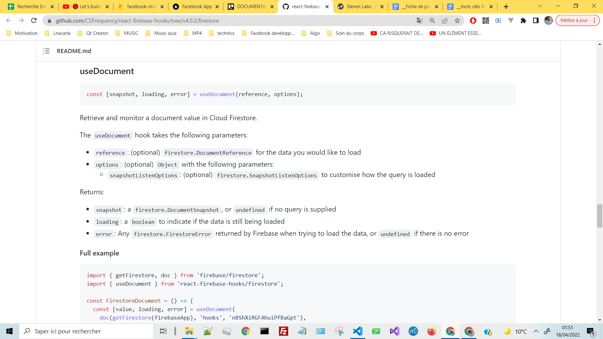
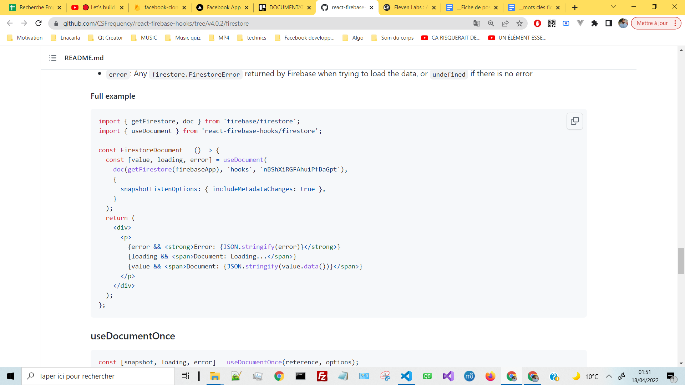
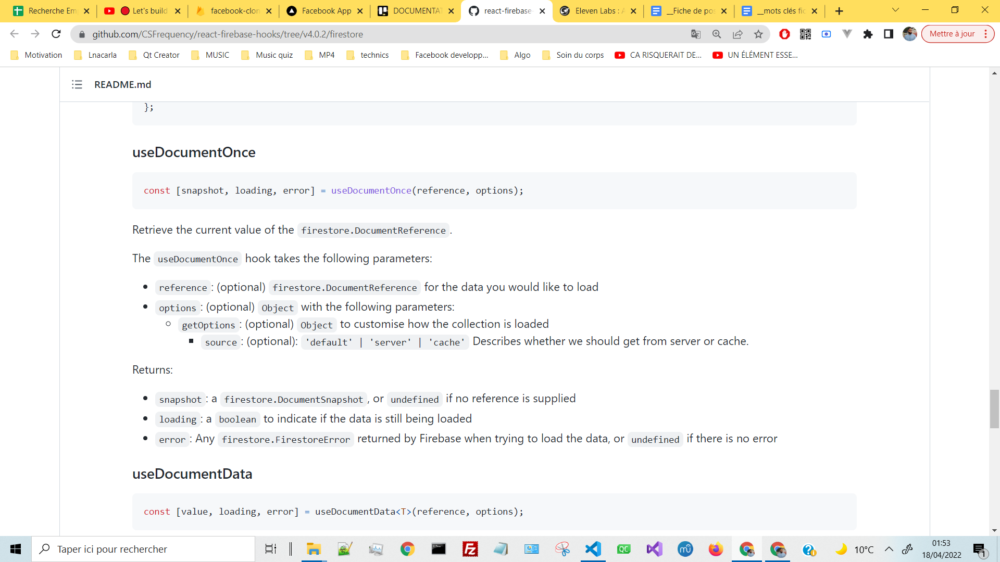
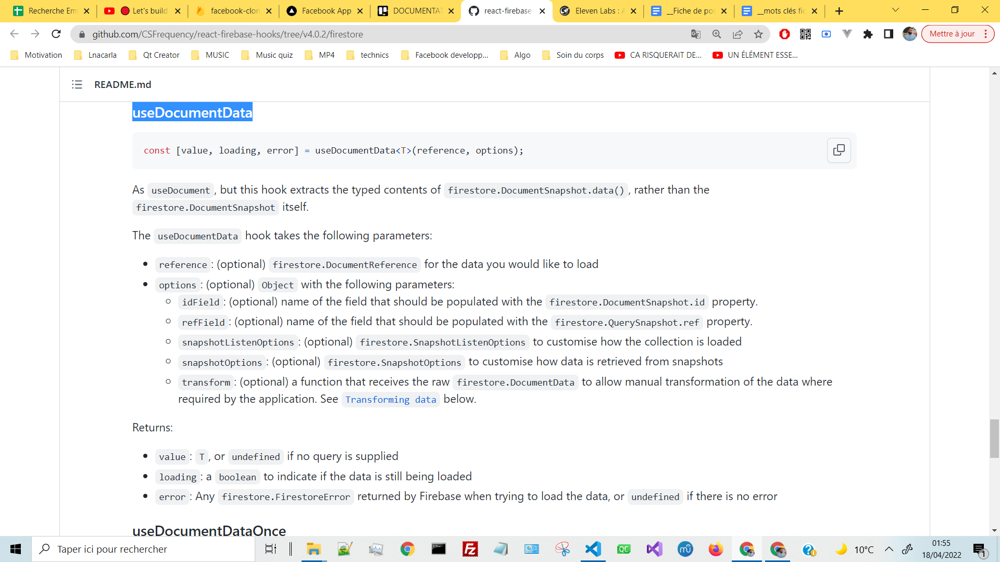
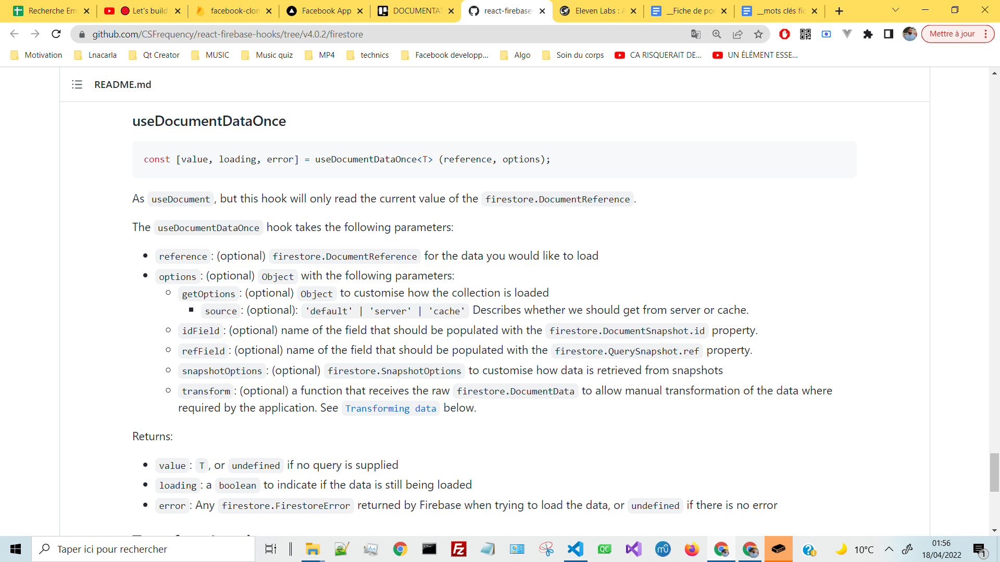

# Installation of the package:
https://www.npmjs.com/package/react-firebase-hooks

# DOCUMENTATION - react-firebase-hooks/firestore

## v4.0.2:
https://github.com/CSFrequency/react-firebase-hooks/tree/v4.0.2

**DOCUMENTATION**
https://github.com/CSFrequency/react-firebase-hooks/tree/v4.0.2/auth
https://github.com/CSFrequency/react-firebase-hooks/tree/v4.0.2/firestore
https://github.com/CSFrequency/react-firebase-hooks/tree/v4.0.2/storage
https://github.com/CSFrequency/react-firebase-hooks/tree/v4.0.2/database

## v3.0.4:
https://github.com/CSFrequency/react-firebase-hooks/tree/v3.0.4

## 1 - useCollection Hook - PARAMETERS

## 2 - useCollection Hook - EXAMPLES

## 3 - useCollectionOnce Hook - PARAMETERS

## 4 - useCollectionData Hook - PARAMETERS

## 5 - useCollectionDataOnce Hook - PARAMETERS

## 6 - useDocument Hook - PARAMETERS

## 7 - useDocument Hook - EXAMPLES

## 8 - useDocumentOnce Hook - PARAMETERS

## 9 - useDocumentData Hook -PARAMETERS

## 10 - useDocumentDataOnce Hook - PARAMETERS

