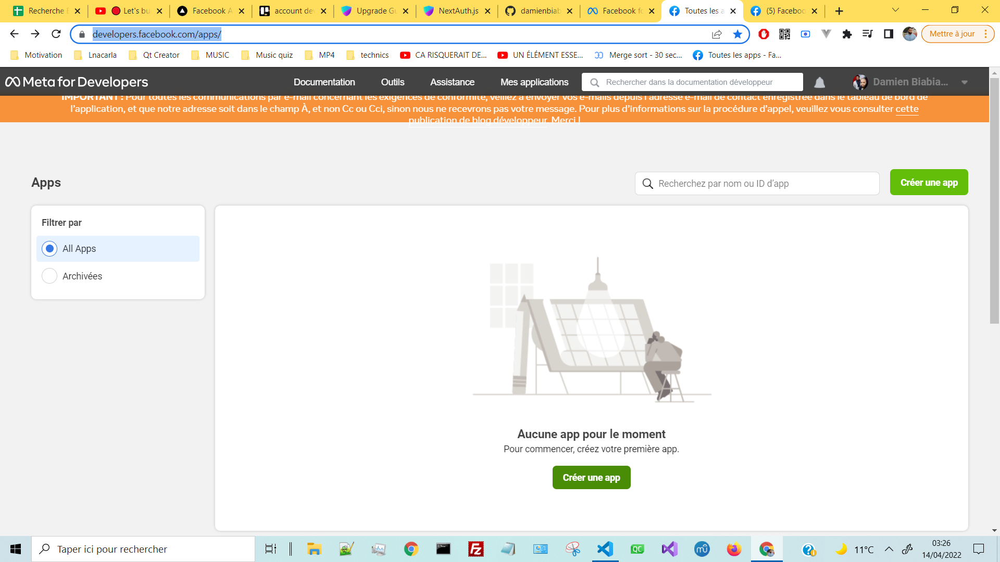
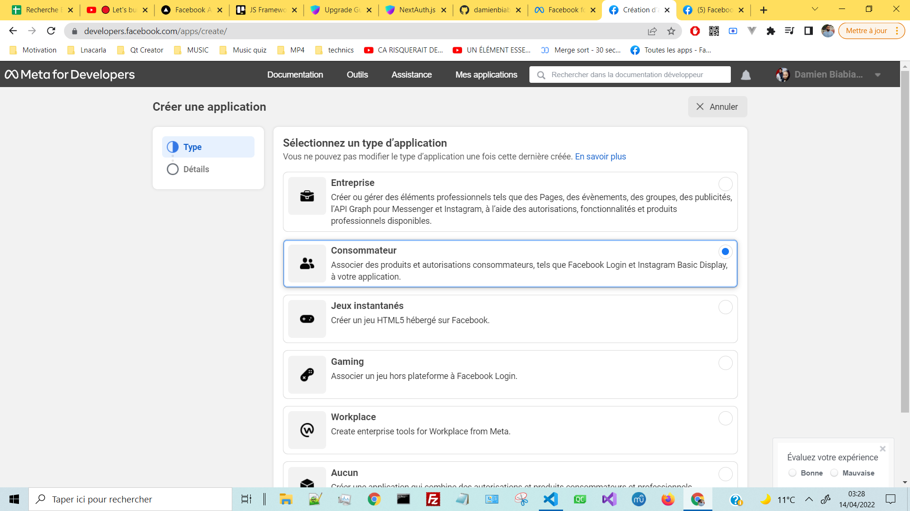
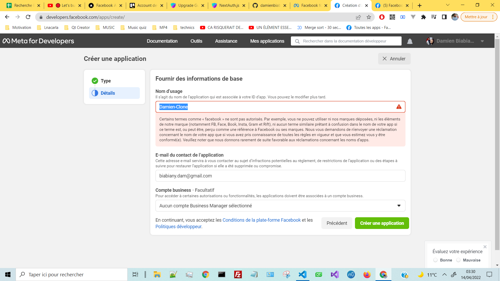
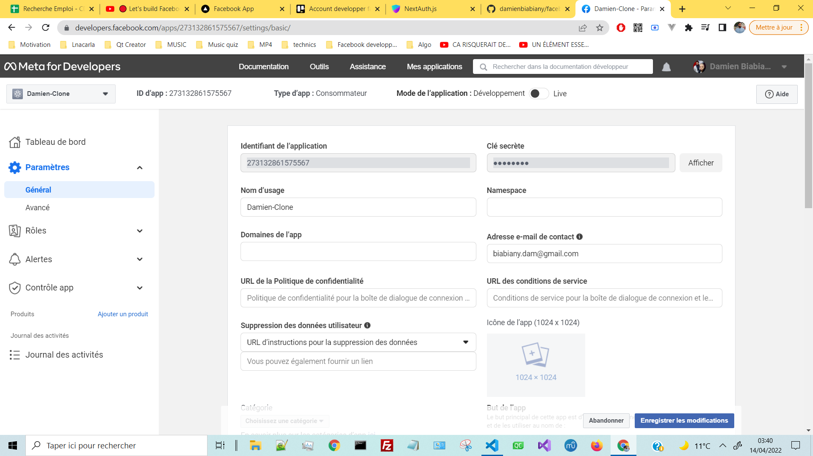
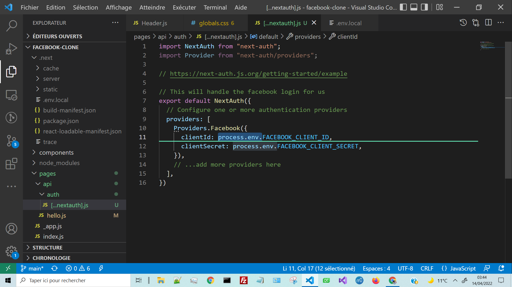
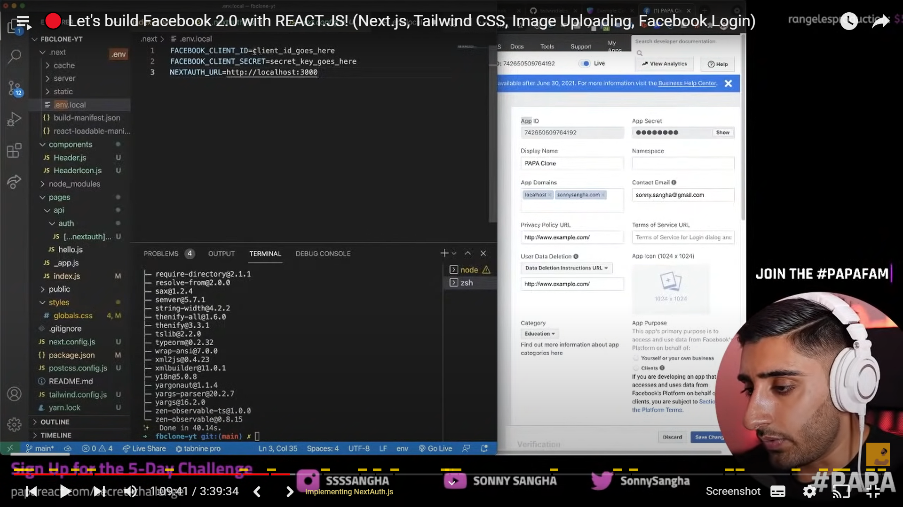

# Account developper facebook - Creating an app

https://developers.facebook.com/

https://developers.facebook.com/async/registration/

## Account info:
biabiany.dam@gmail.com
dam971Elf

https://developers.facebook.com/apps/

## Dashboard
https://developers.facebook.com/apps/273132861575567/add/

On utilise process.env > on va stocker des variables importantes dans .env.local

## 1 - Create an app:

## 2 - Precising the type of application:

## 3 - Name of the application:

## 4 - Paramètres > Général > Keys:

## 5 - On utilise process.env > on va stocker des variables importantes dans .env.local:

## 6 - .env.local file:

